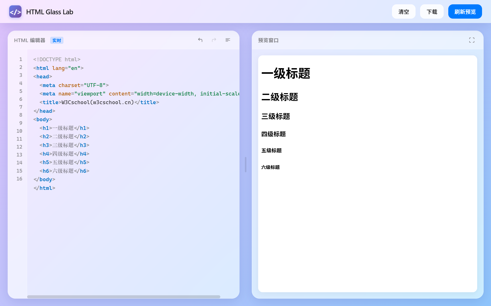

# HTML-Edit-Preview

一款轻量级的 HTML 实时编辑预览器，适合初学者学习和快速原型开发。



## ✨ 特性

- 🎨 **玻璃态设计** - 现代化的 Glassmorphism UI，支持毛玻璃效果和渐变背景
- ⚡ **实时预览** - 编辑代码即时渲染，无需手动刷新
- 📝 **语法高亮** - 原生 HTML 标签、属性、注释的语法着色
- ↩️ **撤销/重做** - 支持 Ctrl+Z / Ctrl+Y 历史记录管理
- 🧹 **代码格式化** - 一键美化 HTML 代码缩进
- ↔️ **拖拽调整** - 自由调整编辑区与预览区宽度比例
- 🖥️ **全屏预览** - 支持全屏模式查看效果
- 💾 **本地保存** - 一键下载 HTML 文件

## 🚀 使用

无需安装，单文件运行：

```bash
git clone https://github.com/wink-wink-wink555/html-edit-preview.git
cd html-edit-preview
# 直接用浏览器打开 HTML-edit&preview.html 即可
```

或者直接下载 `HTML-edit&preview.html` 在浏览器中打开。

## 🎯 适用场景

- HTML/CSS 初学者练习
- 快速编写和测试 HTML 片段
- 轻量级代码演示和分享

